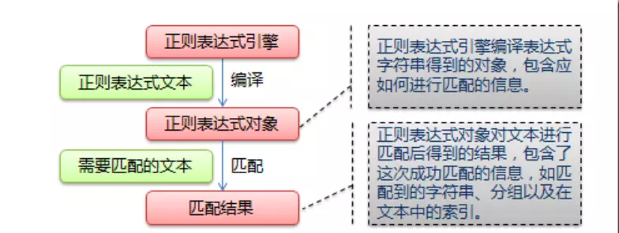
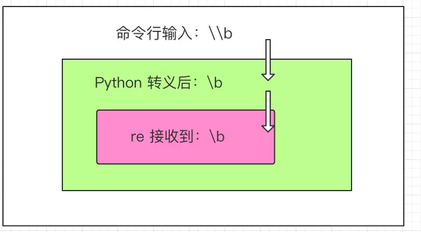
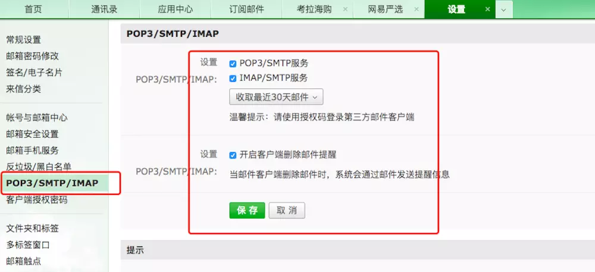

### 4、shutil 压缩打包模块

**shutil 是 Python3 中高级的文件 文件夹 压缩包 处理模块**

#### 1、拷贝文件

拷贝文件的内容到另一个文件中，参数是文件的相对路径或者绝对路径

```python
import shutil    
shutil.copyfile('./src.file','./dst.file')  #给目标文件命名
```

#### 2、拷贝文件和权限

```python
import shutil
shutil.copy2('f1.log', 'f2.log')
```

#### 3、递归拷贝

递归的去拷贝文件夹

**shutil.copytree(src, dst, symlinks=False, ignore=None)**

```python
shutil.copytree('/home','/tmp/hbak',
                ignore=shutil.ignore_patterns('*.txt'))
# 递归拷贝一个文件夹下的所有内容到另一个目录下，目标目录应该是原来系统中不存在的
```

> **shutil.ignore_patterns(\*patterns)** 忽略某些文件
>
> **ignore=shutil.ignore_patterns('排除的文件名', '排除的文件夹名') 支持通配符，假如有多个用逗号隔开**

#### 4、递归删除

递归删除一个文件夹下的所有内容

```python
shutil.rmtree('/tmp/hb')
shutil.rmtree('/tmp/hbad/')

# 最后结尾的一定是明确的文件名，不可以类似下面这样
shutil.rmtree('/tmp/hbak/*')
```

#### 5、递归移动

递归的去移动文件，它类似mv命令。

```python
shutil.move('/home/src.file', './shark') 
```

#### 6、压缩

创建压缩包并返回文件路径，例如：zip、tar

```python
# 将 /home/shark 目录下的所以文件打包压缩到当前目录下，
# 名字 shark,格式 gztar。扩展名会自动根据格式自动生成。

shutil.make_archive('shark',         # 压缩后文件名
                    'gztar',         # 指定的压缩格式
                    '/home/shark/')  # 被压缩的文件夹名字
 
# 将 /home/shark 目录下的所以文件打包压缩到 /tmp 目录下，名字shark,格式 tar
shutil.make_archive( '/tmp/shark','tar','/home/shark/')

# 查看当前 python 环境下支持的压缩格式
ret = shutil.get_archive_formats()
print(ret)
```

#### 7、解压缩

```python
#                     解压的文件名   解压到哪个路径下，压缩的格式
shutil.unpack_archive('./a/b.tar.gz', './a/c/','gztar') 
```

### 5、subprocess 模块执行本机系统命令

`os.system()` 执行的命令只是把命令的结果输出导终端，程序中无法拿到执行命令的结果。

`subprocess` 是开启一个系统底层的单个进程，执行 shell 命令,可以得到命令的执行结果。

```python
# 在 shell 中运行命令，并且获取到标准正确输出、标准错误输出
In [209]: subprocess.getoutput('ls |grep t')
Out[209]: 'test.py' 

In [222]: ret = subprocess.getstatusoutput('date -u')

In [223]: ret
Out[223]: (0, '2018年 03月 26日 星期一 14:46:42 UTC')
```

### 6、Python3 正则模块(标准库)

#### 1、常用特殊字符匹配内容

**字符匹配：**

| 正则特殊字符 | 匹配内容                           |
| ------------ | ---------------------------------- |
| .            | 匹配除换行符(\n)以外的单个任意字符 |
| \w           | 匹配单个字母、数字、汉字或下划线   |
| \s           | 匹配单个任意的空白符               |
| \d           | 匹配单个数字                       |
| \b           | 匹配单词的开始或结束               |
| ^            | 匹配整个字符串的开头               |
| $            | 匹配整个字符串的结尾               |

**次数匹配：**

| 正则特殊字符 | 匹配内容                                                     |
| ------------ | ------------------------------------------------------------ |
| *            | 重复前一个字符 0 - n 次                                      |
| +            | 重复前一个字符 1 - n 次                                      |
| ？           | 重复前一个字符 0 - 1 次                                      |
| {n}          | 重复前一个字符 n 次 `a{2}` 匹配 `aa`                         |
| {n,}         | 重复前一个字符 n 次或 n 次以上 `a{2,}` 匹配 `aa` 或`aaa` 以上 |
| {n, m}       | 重复前一个字符 n 到 m 次之间的任意一个都可以                 |

#### 2、Python 中使用正则的方法

- #### match

只在整个字符串的起始位置进行匹配

**示例字符串**

```python
string = "isinstance yangge enumerate www.qfedu.com 1997"
```

**示例演示：**

```python
import re
In [4]: r = re.match("is\w+", string)

In [8]: r.group()  # 获取匹配成功的结果
Out[8]: 'isinstance'
```

- #### search

从整个字符串的开头找到最后，当第一个匹配成功后，就不再继续匹配。

```python
In [9]: r = re.search("a\w+", string)

In [10]: r.group()
Out[10]: 'ance'    
```

- #### findall

搜索整个字符串，找到所有匹配成功的字符串, 把这些字符串放在一个列表中返回。

```python
In [16]: r = re.findall("a\w+", string)

In [17]: r
Out[17]: ['ance', 'angge', 'ate']
```

- #### sub

把匹配成功的字符串，进行替换。

```python
re.sub的功能
re是regular expression的缩写，表示正则表达式；sub是substitude的缩写，表示替换
re.sub是正则表达式的函数，实现比普通字符串更强大的替换功能 
# 语法：
"""
("a\w+",    "100",        string,     2)
匹配规则,替换成的新内容,  被搜索的对象, 有相同的替换次数
"""
sub(pattern,repl,string,count=0,flag=0)

1、pattern正则表达式的字符串 eg中r'\w+'

2、repl被替换的内容 eg中'10'

3、string正则表达式匹配的内容eg中"xy 15 rt 3e,gep"

4、count:由于正则表达式匹配的结果是多个，使用count来限定替换的个数从左向右，默认值是0，替换所有的匹配到的结果eg中2

5、flags是匹配模式，可以使用按位或者“|”表示同时生效，也可以在正则表达式字符串中指定

eg:
In [24]: import re
In [24]: re.sub(r'\w+','10',"xy 15 rt 3e,gep",2,flags=re.I )
'10 10 rt 3e,gep'，
其中r'\w+'为正则表达式，匹配多个英文单词或者数字，'10'为被替换的内容，“xy 15 rt 3e,gep”是re匹配的字符串内容，count只替换前2个，flag表示忽略大小写

In [24]: r = re.sub("a\w+", "100", string, 2)
  
In [25]: r
Out[25]: 'isinst100 y100 enumera www.qfedu.com 1997'

# 模式不匹配时，返回原来的值
```

- #### split

以匹配到的字符进行分割，返回分割后的列表

```
re.split(pattern, string, maxsplit=0, flags=0)

pattern compile 生成的正则表达式对象，或者自定义也可
string 要匹配的字符串
maxsplit 指定最大分割次数，不指定将全部分割

flags 标志位参数 （了解）
re.I(re.IGNORECASE) 
使匹配对大小写不敏感

re.L(re.LOCAL)  
做本地化识别（locale-aware）匹配

re.M(re.MULTILINE)  
多行匹配，影响 ^ 和 $

re.S(re.DOTALL) 
使 . 匹配包括换行在内的所有字符

re.U(re.UNICODE)    
根据Unicode字符集解析字符。这个标志影响 \w, \W, \b, \B.

re.X(re.VERBOSE)    
该标志通过给予你更灵活的格式以便你将正则表达式写得更易于理解。
```


```python
In [26]: string
Out[26]: 'isinstance yangge enumerate www.qfedu.com  1997'

In [27]: r = re.split("a", string, 1)
```

使用多个界定符分割字符串

```python
>>> line = 'asdf fjdk; afed, fjek,asdf,  foo'
>>> import re
>>> re.split(r'[;,\s]\s*', line)
['asdf', 'fjdk', 'afed', 'fjek', 'asdf', 'foo']
```

#### 3、正则分组

==从已经成功匹配的内容中，再去把想要的取出来==

```python
# match
In [64]: string
Out[64]: 'isinstance yangge enumerate www.qfedu.com  1997'

In [65]: r = re.match("is(\w+)", string)

In [66]: r.group()
Out[66]: 'isinstance'

In [67]: r.groups()
Out[67]: ('instance',)
    
In [68]: r = re.match("is(in)(\w+)", string))
    
In [69]: r.groups()
Out[69]: ('in', 'stance')

# search
# 命名分组
In [87]: r = re.search("is\w+\s(?P<name>y\w+e)", string)  

In [88]: r.group()
Out[88]: 'isinstance yangge'

In [89]: r.groups()
Out[89]: ('yangge',)
6
In [90]: r.groupdict()
Out[90]: {'name': 'yangge'}
8

# findall
In [98]: string
Out[98]: 'isinstance all yangge any enumerate www.qfedu.com  1997'

In [99]: r = re.findall("a(?P<name>\w+)", string)

In [100]: r
Out[100]: ['nce', 'll', 'ngge', 'ny', 'te']

In [101]: r = re.findall("a(\w+)", string)

In [102]: r
Out[102]: ['nce', 'll', 'ngge', 'ny', 'te']

    
# split
In [113]: string
Out[113]: 'isinstance all yangge any enumerate www.qfedu.com 1997'

In [114]: r = re.split("(any)", string)

In [115]: r
Out[115]: ['isinstance all yangge ', 'any', ' enumerate www.qfedu.com 1997']

In [116]: r = re.split("(a(ny))", string)

In [117]: r
Out[117]:
['isinstance all yangge ',
 'any',
 'ny',
 ' enumerate www.qfedu.com 1997']

In [118]: tag = 'value="1997/07/01"'

In [119]: s = re.sub(r'(value="\d{4})/(\d{2})/(\d{2}")', r'\1-\2-\3', tag)

In  [120]: s
Out [120]: value="1997-07-01"   
```

- #### 编译正则

对于程序频繁使用的表达式，编译这些表达式会更有效。

compile 函数用于编译正则表达式，返回的是一个正则表达式（ Pattern ）对象，利用这个对象的相关方法再去匹配字符串。


 

**好处：**

re 模块会维护已编译表达式的一个缓存。

不过，这个缓存的大小是有限的，直接使用已编译的表达式可以避免缓存查找开销。

使用已编译表达式的另一个好处是，通过在加载模块时预编译所有表达式，可以把编译工作转到应用 一开始时，而不是当程序响应一个用户动作时才进行编译。

```python
In [130]: regexes = re.compile("y\w+")

In [131]: r = regexes.search(string)

In [132]: r.group()
Out[132]: 'yangge'
```

- #### 常用正则

```python
# IP：
r"\b(?:[0-9]{1,3}\.){3}[0-9]{1,3}\b"
# 手机号：
r'\b1[3|4|5|6|7|8|9][0-9]\d{8}'
# 邮箱：
shark123@qq.com
shark123@163.com
r'[a-zA-Z0-9_-]+@[a-zA-Z0-9_-]+(.[a-zA-Z0-9_-]+)+'
```

- #### 强调知识点

```python
# 匹配所有包含小数在内的数字
print(re.findall('\d+\.?\d*',"asdfasdf123as1.13dfa12adsf1asdf3")) #['123', '1.13', '12', '1', '3']

#.*默认为贪婪匹配
print(re.findall('a.*b','a1b22222222b')) 
#['a1b22222222b']

#.*?为非贪婪匹配：推荐使用
print(re.findall('a.*?b','a1b22222222b')) 
#['a1b']
```

- #### 元字符

```python
# \b 表示匹配单词边界，详见后面的速查表

In [17]: re.search('hello\b', 'hello world')

In [18]: re.search('hello\\b', 'hello world')
Out[18]: <_sre.SRE_Match object; span=(0, 5), match='hello'>
```

 

**Python 自己也有转义**

**使用 r 禁止 Python 转义**

```python
In [19]: re.search(r'hello\b', 'hello world')
Out[19]: <_sre.SRE_Match object; span=(0, 5), match='hello'>
```

- #### 扩展知识点

最后一个参数 **flag**

可选值有：

```python
re.I       # 忽略大小写
```

示例：

```python
In [186]: s1 = string.capitalize()

In [187]: s1
Out[187]: 'Isinstance all yangge any enumerate www.qfedu.com 1997'

In [192]: r = re.search('is',s, re.I)
Out[192]: <_sre.SRE_Match object; span=(0, 2), match='Is'>
```

#### 4、正则模式速查表

| 模式        | 描述                                                         |
| ----------- | ------------------------------------------------------------ |
| ^           | 匹配字符串的开头                                             |
| $           | 匹配字符串的末尾。                                           |
| .           | 匹配任意字符，除了换行符，当re.DOTALL标记被指定时，则可以匹配包括换行符的任意字符。 |
| [...]       | 用来表示一组字符,单独列出：[amk] 匹配 'a'，'m'或'k'          |
| [^...]      | 不在[]中的字符：[^abc] 匹配除了a,b,c之外的字符。             |
| re*         | 匹配0个或多个的表达式。                                      |
| re+         | 匹配1个或多个的表达式。                                      |
| re?         | 匹配0个或1个由前面的正则表达式定义的片段，非贪婪方式         |
| re{ n}      | 匹配n个前面表达式。。例如，"o{2}"不能匹配"Bob"中的"o"，但是能匹配"food"中的两个o。 |
| re{n,}      | 精确匹配n个前面表达式。例如，"o{2,}"不能匹配"Bob"中的"o"，但能匹配"foooood"中的所有o。"o{1,}"等价于"o+"。"o{0,}"则等价于"o*"。 |
| re{n,m}     | 匹配 n 到 m 次由前面的正则表达式定义的片段，贪婪方式         |
| a\| b       | 匹配a或b                                                     |
| (re)        | 匹配括号内的表达式，也表示一个组                             |
| (?imx)      | 正则表达式包含三种可选标志：i, m, 或 x 。只影响括号中的区域。 |
| (?-imx)     | 正则表达式关闭 i, m, 或 x 可选标志。只影响括号中的区域。     |
| (?: re)     | 类似 (...), 但是不表示一个组                                 |
| (?imx: re)  | 在括号中使用i, m, 或 x 可选标志                              |
| (?-imx: re) | 在括号中不使用i, m, 或 x 可选标志                            |
| (?#...)     | 注释.                                                        |
| (?= re)     | 前向肯定界定符。如果所含正则表达式，以 ... 表示，在当前位置成功匹配时成功，否则失败。但一旦所含表达式已经尝试，匹配引擎根本没有提高；模式的剩余部分还要尝试界定符的右边。 |
| (?! re)     | 前向否定界定符。与肯定界定符相反；当所含表达式不能在字符串当前位置匹配时成功 |
| (?> re)     | 匹配的独立模式，省去回溯。                                   |
| \w          | 匹配字母数字及下划线                                         |
| \W          | 匹配非字母数字及下划线                                       |
| \s          | 匹配任意空白字符，等价于 [\t\n\r\f].                         |
| \S          | 匹配任意非空字符                                             |
| \d          | 匹配任意数字，等价于 [0-9].                                  |
| \D          | 匹配任意非数字                                               |
| \A          | 匹配字符串开始                                               |
| \Z          | 匹配字符串结束，如果是存在换行，只匹配到换行前的结束字符串。 |
| \z          | 匹配字符串结束                                               |
| \G          | 匹配最后匹配完成的位置。                                     |
| \b          | 匹配一个单词边界，也就是指单词和空格间的位置。例如， 'er\b' 可以匹配"never" 中的 'er'，但不能匹配 "verb" 中的 'er'。 |
| \B          | 匹配非单词边界。'er\B' 能匹配 "verb" 中的 'er'，但不能匹配 "never" 中的 'er'。 |
| \n, \t, 等. | 匹配一个换行符。匹配一个制表符。等                           |
| \1...\9     | 匹配第n个分组的内容。                                        |
| \10         | 匹配第n个分组的内容，如果它经匹配。否则指的是八进制字符码的表达式。 |

### 7、Python3 邮件模块

**使用第三方库 `yagmail`**

------

> 更新： 第三种方式的隐藏用户名和密码的方式，目前不再支持

------

#### 1、简单介绍 yagmail

目标是尽可能简单，无痛地发送电子邮件。

最终的代码如下：

```python
import yagmail
yag = yagmail.SMTP()
contents = ['This is the body, and here is just text http://somedomain/image.png',
            'You can find an audio file attached.', '/local/path/song.mp3']
yag.send('to@someone.com', '邮件标题', contents)
```

或者在一行中实现：

```python
yagmail.SMTP('mygmailusername').send('to@someone.com', 'subject', 'This is the body')
```

当然, 以上操作需要从你自己系统的密钥环中读取你的邮箱账户和对应的密码。关于密钥环稍后会提到如何实现。

#### 2、安装模块

```shell
pip3 install  yagmail    # linux / Mac
pip install   yagmail    # windows
```

这样会安装最新的版本，并且会支持所有最新功能，主要是支持从密钥环中获取到邮箱的账户和密码。

#### 3、关于账户和密码

**开通自己邮箱的 `SMTP` 功能，并获取到授权码**

这个账户是你要使用此邮箱发送邮件的账户，密码不是平时登录邮箱的密码，而是开通 `POP3/SMTP` 功能后设置的客户端授权密码。

这里以 `126` 邮箱为例：

 

 

 

#### 4、方式一：不使用系统的密钥环

不使用系统的密钥环，可以直接暴露账户和密码在脚本里

```python
import yagmail
yag = yagmail.SMTP(
            user='自己的账号',
            password='账号的授权码',
            host='smtp.qq.com',  # 邮局的 smtp 地址
            port='端口号',       # 邮局的 smtp 端口
            smtp_ssl=False)

yag.send(to='收件箱账号',
         subject='邮件主题',
         contents='邮件内容')
```

#### 5、方式二： 使用系统的密钥环管理账户和授权码

模块支持从当前系统环境中的密钥环中获取账户和密码，要想实现这个功能，需要依赖模块 `keyring`。之后把账户和密码注册到系统的密钥环中即可实现。

**1. 安装依赖模块**

```python
pip3 install  keyring 

# CentOS7.3之后 还需要安装下面的模块
pip3 install keyrings.alt
```

**2. 开始向密钥环注册**

```python
import yagmail
yagmail.register('你的账号', '你的授权密码')
```

> 注册账户和密码，只需要执行一次即可。

**3. 发送邮件**

```python
import yagmail

yag = yagmail.SMTP('自己的账号',
            host='smtp.qq.com',  # 邮局的 smtp 地址
            port='端口号',       # 邮局的 smtp 端口
            smtp_ssl=False  # 不使用加密传输
）

yag.send(
    to='收件箱账号',
    subject='邮件主题',
    contents='邮件内容')
```

#### 6、示例展示

下面是以我的 126 邮箱为例, 使用系统密钥环的方式，向我的 163邮箱发送了一封邮件。

```python
import yagmail

yag = yagmail.SMTP(user='shark@126.com',
                   host='smtp.126.com',
                   port=25,
                   smtp_ssl=False)
yag.send(to='docker@163.com',
         subject='from shark',
         contents='test')
```

这样就愉快的发送了一封测试邮件到 `docker@163.com` 的邮箱。

当然前提是:

1. 126 邮箱开通了 `SMTP`功能。
2. 把 126 邮箱的账号和密码已经注册到自己系统的密钥环中。

#### 7、发送附件

**发送**

发送附件只需要给 `send`方法传递 `attachments` 关键字参数

比如我在系统的某一个目录下有一张图片，需要发送给 `docker@163.com`

```python
import yagmail

yag = yagmail.SMTP(user='shark@126.com',
                   host='smtp.126.com',
                   port=25,
                   smtp_ssl=False)
yag.send(to='docker@163.com',
         subject='from shark',
         contents='test',
         attachments='./松鼠.jpeg')
```

#### 8、收到的邮件和附件

 

image.png

#### 9、使用 `ssl` 发送加密邮件

要发送加密邮件，只需要把 `smtp_ssl` 关键字参数去掉即可，因为默认就是采用的加密方式 `smtp_ssl=True`。

不传递 `stmp_ssl` 关键字参数的同时，需要设置端口为邮箱服务提供商的加密端口，这里还是以 126 邮箱为例，端口是 `465`。

```python
import yagmail

yag = yagmail.SMTP(user='shark@126.com',
                   host='smtp.126.com',
                   port=465)
yag.send(to='docker@163.com',
         subject='from sharkyunops',
         contents='test',
         attachments='./松鼠.jpeg')
```

#### 10、发送 带 html 标记语言的邮件内容

在实际的生产环境中，经常会发送邮件沟通相关事宜，往往会有表格之类的内容，但是又不想以附件的形式发送，就可以利用 html 标记语言的方式组织数据。

```python
import yagmail

yag = yagmail.SMTP(user='shark@126.com',
                   host='smtp.126.com',
                   port=465)

html="""<table border="1">
    <thead>
    <tr>
        <th>姓名</th>
        <th>年龄</th>
    </tr>
    </thead>
    <tbody>
    <tr>
        <td>shak</td>
        <td>18</td>
    </tr>
    <tr>
        <td>西瓜甜</td>
        <td>28</td>
    </tr>
    </tbody>
</table>
"""

yag.send(to='docker@163.com',
         subject='from sharkyunops',
         contents=['test',html])
```

 

#### 11、更多

如果不指定`to`参数，则发送给自己

如果`to`参数是一个列表，则将该邮件发送给列表中的所有用户

`attachments` 参数的值可以是列表，表示发送多个附件

### 8、Python3 paramiko 模块

Paramiko 模块提供了基于ssh连接，进行远程登录服务器执行命令和上传下载文件的功能。这是一个第三方的软件包，使用之前需要安装。

#### 1、安装

```
pip3 install paramiko
```

#### 2、执行命令

##### 1、基于用户名和密码的连接

 

**封装 Transport**

```python
import paramiko
#实例化一个transport（传输）对象
transport = paramiko.Transport(('172.16.32.129',2323))
#建立连接
transport.connect(username='root',password='123')
#建立ssh对象
ssh = paramiko.SSHClient()
#绑定transport到ssh对象
ssh._transport=transport
#执行命令
stdin,stdout,stderr=ssh.exec_command('df')
#打印输出
print(stdout.read().decode())
#关闭连接
transport.close()

import paramiko
transport = paramiko.Transport(('172.16.153.134', 22))
transport.connect(username='root', password='upsa')

ssh = paramiko.SSHClient()
ssh._transport = transport

stdin, stdout, stderr = ssh.exec_command('df -P')
print(stdout.read().decode())

transport.close()
```

##### 2. 基于公钥秘钥连接

**一定要先建立公钥信任**

```python
#创建密钥对，建立密钥信任,必须先将公钥文件传输到服务器的~/.ssh/authorized_keys中
ssh-keygen 
ssh-copy-id 192.168.95.154

#!/usr/local/bin/pyton3
#coding:utf8
import paramiko
# 指定本地的RSA私钥文件,如果建立密钥对时设置的有密码，password为设定的密码，如无不用指定password参数
pkey = paramiko.RSAKey.from_private_key_file('id_rsa')
#建立连接
ssh = paramiko.SSHClient()
#允许将信任的主机自动加入到known_hosts列表
ssh.set_missing_host_key_policy(paramiko.AutoAddPolicy())
ssh.connect(hostname='172.16.32.129',port=22,username='root',pkey=pkey) #指定密钥连接
#执行命令
stdin,stdout,stderr=ssh.exec_command('free -m')
print(stdout.read().decode())
ssh.close()

注意：
import paramiko
client = paramiko.SSHClient()
client.connect(serverIp, port=serverPort, username=serverUser)

报警告如下：
paramiko\ecdsakey.py:164: CryptographyDeprecationWarning: Support for unsafe construction of public numbers from encoded data will be removed in a future version. Please use EllipticCurvePublicKey.from_encoded_point
  self.ecdsa_curve.curve_class(), pointinfo
paramiko\kex_ecdh_nist.py:39: CryptographyDeprecationWarning: encode_point has been deprecated on EllipticCurvePublicNumbers and will be removed in a future version. Please use EllipticCurvePublicKey.public_bytes to obtain both compressed and uncompressed point encoding.
  m.add_string(self.Q_C.public_numbers().encode_point())
paramiko\kex_ecdh_nist.py:96: CryptographyDeprecationWarning: Support for unsafe construction of public numbers from encoded data will be removed in a future version. Please use EllipticCurvePublicKey.from_encoded_point
  self.curve, Q_S_bytes
paramiko\kex_ecdh_nist.py:111: CryptographyDeprecationWarning: encode_point has been deprecated on EllipticCurvePublicNumbers and will be removed in a future version. Please use EllipticCurvePublicKey.public_bytes to obtain both compressed and uncompressed point encoding.
  hm.add_string(self.Q_C.public_numbers().encode_point())
原因
paramiko 2.4.2 依赖 cryptography，而最新的cryptography==2.5里有一些弃用的API。

解决
删掉cryptography 2.5，安装2.4.2，就不会报错了。

pip uninstall cryptography==2.5
pip install cryptography==2.4.2

```

#### 2、文件上传下载

**SFTPClient:**

用于连接远程服务器并进行上传下载功能。

下面的命令可以快速创建密钥对，并用 -t 指定了算法类型为 ecdsa

ssh-keygen -t ecdsa -N "" 
ssh-keygen 
ssh-copy-id 192.168.95.154

##### 1、基于用户名密码上传下载

```python
import paramiko
transport = paramiko.Transport(('10.18.46.104',22))
transport.connect(username='root',password='123.com')

sftp = paramiko.SFTPClient.from_transport(transport)

# 将ssh-key.py 上传至服务器 /tmp/ssh-key.py
sftp.put('ssh-key.py', '/tmp/ssh-key.txt')  # 后面指定文件名称

# 将远程主机的文件 /tmp/ssh-key.py 下载到本地并命名为  ssh-key.txt
sftp.get('/tmp/ssh-key.py', 'ssh-key.txt')

transport.close()
```

##### 2、基于公钥秘钥上传下载

```python
import paramiko

# 创建一个本地当前用户的私钥对象
#private_key = paramiko.ECDSAKey.from_private_key_file('/root/.ssh/id_ecdsa')
private_key = paramiko.RSAKey.from_private_key_file('/root/.ssh/id_rsa')
# 创建一个传输对象
transport = paramiko.Transport(('10.18.46.104',22))

# 使用刚才的传输对象创建一个传输文件的的连接对象
transport.connect(username='root', pkey=private_key)

sftp = paramiko.SFTPClient.from_transport(transport)

# 将ssh-key.py 上传至服务器 /tmp/ssh-key.py
sftp.put('ssh-key.py', '/tmp/ssh-key.txt')

# 将远程主机的文件 /tmp/test.py 下载到本地并命名为  some.py
sftp.get('/tmp/ssh-key.py', 'ssh-key.txt')
transport.close()
```