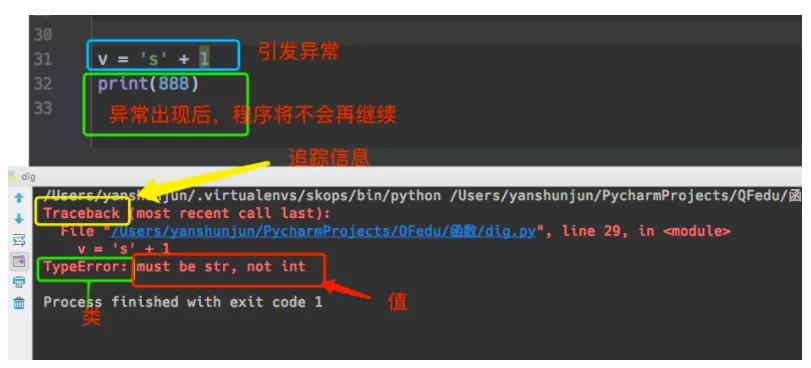

## 十九、Python3 操作数据库

### 1、Python3 操作 MySQL

#### 1、基本介绍

- Python3 操作 MySQL 数据库 可以使用的模块是 `pymysql` 和 `MySQLdb`。

- 这个两个模块都是通过自己的 API 执行原生的 SQL 语句实现的。

- MySQLdb 是最早出现的一个操作 MySQL 数据库的模块，核心由C语言编写，接口精炼，性能最棒，缺点是环境依赖较多，安装稍复杂，近两年已停止更新，且只支持Python2.x，不支持Python3.x。

- `pymysql` 为替代 `MySQLdb` 而生，纯 `Python` 实现，API 的接口与 `MySQLdb` 完全兼容，安装方便，支持Python3。

- 2020 已经离我们很近了，所以，我们这里只聊 `pymysql`

#### 2、 安装包 `pymysql`

pymysql是Python中操作MySQL的模块(Linux 机器)

```shell
pip3 install pymysql
```

#### 3、 基本操作

##### 1、创建表

```python
import pymysql 
创建连接
conn = pymysql.connect(host='172.16.153.10',
                       port=3306,
                       user='root',
                       passwd='123', 
                       db='shark_db',
                       charset='utf8mb4')
获取游标对象
cursor = conn.cursor()
定义 sql 语句
create_table_sql = """create table test1
 (id int auto_increment primary key, 
  name varchar(10) not null, 
  age int not null)"""

执行 sql 语句
cursor.execute(create_table_sql)

提交
conn.commit()

关闭游标对象
cursor.close()

关闭连接对象
conn.close()
```

##### 2、插入数据

**一次插入一条数据**

```python
一次插入一条数据, 并且使用变量占位符
insert_data_sql = "insert into t1(name, age) values(%s, %s);"
row = cursor.execute(insert_data_sql, ('shark', 18))
conn.commit()
cursor.close()
conn.close()
```

**一次插入多条数据**

```python
定义插入数据的语句
many_sql = "insert into t1 (name, age) values(%s, %s)"

一次插入多条数据
row = cursor.executemany(many_sql, [('shark1', 18),('xiguatian', 20),('qf', 8)])

conn.commit()
cursor.close()
conn.close()
```

##### 3、查询数据

###### 1、**获取到的数据是元组类型**

```python
定义一个查询语句
query_sql = "select id,name,age from t1 where name=%s;"

执行查询语句，并且返回得到结果的行数
row_nums = cursor.execute(query_sql, ('shark2'))

"""
获取到数据结果集具有迭代器的特性:
1. 可以通过索引取值，可以切片
2. 结果集中的数据每次取出一条就少一条
"""

获取数据中的第一条
one_data = cursor.fetchone()

获取数据中的指定数量的条目
many_data = cursor.fetchmany(2)

获取数据中剩余的全部数据
all_data = cursor.fetchall()

cursor.close()
conn.close()
print(row_nums)
print(one_data)
print(many_data)
print(all_data)
```

###### 2、**获取到的数据是字典类型的**

```python
游标设置为字典类型
cursor = conn.cursor(cursor=pymysql.cursors.DictCursor)

query_sql = "select id,name,age from t1 where name=%s;"

row_nums = cursor.execute(query_sql, ('shark2'))

获取结果的操作和之前的一样
result = cursor.fetchone()
conn.commit()
cursor.close()
conn.close()

print(result)
```

#### 4、应该加入异常处理

```python
import pymysql
  
# 创建连接
conn = pymysql.connect(host='172.16.153.10',
                       port=3306,
                       user='root',
                       passwd='123', 
                       db='shark_db')

# 创建游标
cursor = conn.cursor()
 
try:
    cursor.executemany("INSERT INTO para5(name,age) VALUES(%s,%s);", [('次牛444', '12'), ("次牛2", '11'), ('次牛3', '10')])
    conn.commit()
except Exception as e:
    # 如果执行sql语句出现问题，则执行回滚操作
    conn.rollback()
    print(e)
finally:
    # 不论try中的代码是否抛出异常，
    # 这里都会执行关闭游标和数据库连接
    cursor.close()
    conn.close()
```

#### 5、 获取新增数据的自增 ID

```python
# 先连接
cursor = conn.cursor()
cursor.executemany("insert into student(name,age, phone)values(%s,%s, %s)",
                   [ ("superman5110",18, '13295686769')]   )
conn.commit()
cursor.close()
conn.close()
  
# 获取最新自增ID
new_id = cursor.lastrowid
```

#### 6、操作存储过程(扩展)

**无参数存储过程**

```
cursor.callproc('p1')  #等价于cursor.execute("call p1()")
```

**有参存储过程**

```python
cursor.callproc('p2', args=(1, 22, 3, 4))

#获取执行完存储的参数,参数@开头
cursor.execute("select @p2,@_p2_1,@_p2_2,@_p2_3")  #{'@_p2_1': 22, '@p2': None, '@_p2_2': 103, '@_p2_3': 24}


row_1 = cursor.fetchone()
```

## 二十、异常处理

### 1、什么是异常

异常就是程序运行时发生错误的信号（在程序出现错误时，则会产生一个异常，若程序没有处理它，则会抛出该异常，程序的运行也随之终止），所以，在编程过程中为了增加友好性，在程序出现bug时一般不会将错误信息显示给用户，而是现实一个提示的页面或者信息，在python中,错误触发的异常如下：

 

### 2、而错误分成以下两种情况

#### 1、语法错误

```python
#语法错误一
if
#语法错误二
def test:
    pass
#语法错误三
class Foo
    pass
#语法错误四
print(haha
```

#### 2、非语法错误

```python
# TypeError:int类型不可迭代
for i in 3:
    pass

# ValueError
inp=input(">>: ") # 输入 qf
int(inp)

# NameError
aaa

# IndexError
l=['yangge','aa']
l[3]

# KeyError
dic={'name':'yangge'}
dic['age']

# AttributeError
class Foo:
    pass
Foo.x

# ZeroDivisionError:无法完成计算
res1=1/0
```

### 3、异常的种类

在python中不同的异常可以用不同的类型（python3中统一了类与类型，类型即类）去标识，一个异常标识一种错误，python中的异常种类非常多，每个异常专门用于处理某一项异常

```python
# 试图访问一个对象没有的属性，比如foo.x，但是foo没有属性x
AttributeError 

# 输入/输出异常；基本上是无法打开文件
IOError 

# 无法导入模块或包；基本上是路径问题或名称错误
ImportError 

# 语法错误（的子类） ；代码没有正确对齐
IndentationError 

# 下标索引超出序列边界，比如当 li 只有三个元素，却试图访问 li[5]
IndexError 

# 试图访问字典里不存在的键
KeyError 

#  按了一下 Ctrl+C
KeyboardInterrupt

# 使用一个还未被赋予对象的变量
NameError 

# 无效语法，语法错误
SyntaxError 

# 传入对象类型不符合要求，如sum 函数需要的是 int，但你传入了 str
TypeError 

# 试图访问一个还未被设置的局部变量，基本上是由于另有一个同名的全局变量，导致你以为正在访问它
UnboundLocalError 
# 例如：
"""
x = 1
def func():
    x += 1
    return x

func()

UnboundLocalError: local variable 'x' referenced before assignment
# 局部变量 x 在赋值之前被引用
"""

# 传入一个调用者不期望的值，即使值的类型是正确的，比如 int('a')
ValueError 

#python中全部的异常类型
ArithmeticError
AssertionError
AttributeError
BaseException
BufferError
BytesWarning
DeprecationWarning
EnvironmentError
EOFError
Exception
FloatingPointError
FutureWarning
GeneratorExit
ImportError
ImportWarning
IndentationError
IndexError
IOError
KeyboardInterrupt
KeyError
LookupError
MemoryError
NameError
NotImplementedError
OSError
OverflowError
PendingDeprecationWarning
ReferenceError
RuntimeError
RuntimeWarning
StandardError
StopIteration
SyntaxError
SyntaxWarning
SystemError
SystemExit
TabError
TypeError
UnboundLocalError
UnicodeDecodeError
UnicodeEncodeError
UnicodeError
UnicodeTranslateError
UnicodeWarning
UserWarning
ValueError
Warning
ZeroDivisionError
```

### 4、异常处理

为了保证程序的健壮性与容错性，即在遇到错误时程序不会崩溃，我们需要对异常进行处理，

如果错误发生的条件是可预知的，我们需要用if进行处理：在错误发生之前进行预防

```python
def func(arg):
        if arg is int:
            arg += 1
        else:
            arg = int(arg)
            arg += 1
        return arg
```

**如果错误发生的条件是不可预知的，则需要用到try...except：在错误发生之后进行处理**

#### 1、基本语法为

```python
try:
    被检测的代码块
except 异常类型 as 异常信息变量名：
    try中一旦检测到异常，就执行这个位置的逻辑
```

**例子**

```python
def func(arg):
    try:
        arg +=1
    except TypeError as e:
        print(e)

func('杨哥')
```

#### 2、使用正确的异常类型

异常处理，只可以捕获到声明的异常种类和发生异常的种类相匹配的情况。
假如发生的异常类型和你指定捕获到异常不能匹配，就无法处理。

```python
x = '杨哥'
try:
    int(x)
except IndexError as e: # 未捕获到异常，程序直接报错
    print(e)
```

#### 3、处理异常的多分支操作

```python
x = '杨哥'
try:
    int(x)
except IndexError as e:
    print(e)
except KeyError as e:
    print(e)
except ValueError as e:
    print(e)
```

#### 4、万能异常 Exception

```python
x = '杨哥'
try:
    int(x)
except Exception as e:
    print(e)
```

#### 5、多分支异常与万能异常结合使用

假如对于不同种类的异常我们需要定制不同的处理逻辑，那就需要用到多分支了。 也可以在多分支的最后写一个Exception

```python
x = '杨哥'
try:
    x[3]
except IndexError as e:
    print(e)
except KeyError as e:
    print(e)
except ValueError as e:
    print(e)
except Exception as e:
    print(e)
```

#### 6、或者无论出现什么异常，都统一丢弃，或者使用同一段代码逻辑去处理

所有的异常! 只有一个Exception就足够了，这是不好的做法。

```python
try:
    print('a'[3])
except Exception as e:
    print(e)
```

#### 7、异常的其他结构

```python
x = '杨哥'
try:
    int(x)
except IndexError as e:
    print(e)
except KeyError as e:
    print(e)
except ValueError as e:
    print(e)
else:
    print('try内代码块没有异常则执行我')
finally:
    print('无论异常与否,都会执行该模块,通常是进行清理工作')

#如果try中没有异常，那么except部分将跳过，执行else中的语句。（前提是try里没有返回值）
#finally是无论是否有异常，最后都要做的一些事情。”（无论try里是否有返回值）
```

#### 8、主动触发异常

```python
try:
    raise TypeError('类型错误')
except Exception as e:
    print(e)

helper.py
def f1():
    print('f1')
    
index.py
import helper
if __name__ == '__main__'
	try:
        n = '1'
        n = int(n)
        ret = helper.f1()
        if ret:
            print('成功')
        else:
            raise Exception('调用失败')
    except Exception,e:
        print('出现错误')
        print(e)
        
```

### 5、更详细的异常信息输出(生产环境必备)

python中用于处理异常栈的模块是traceback模块，它提供了print_exception、format_exception等输出异常栈等常用的工具函数

```python
import traceback
print('start-->')
try:
    1 + 'a'
except TypeError as e:
    print(e)
    print('*' * 30)
    #traceback.print_exc()
    print(traceback.format_exc())
    print('*' * 20)
print('end')

# traceback.print_exc()跟traceback.format_exc()有什么区别呢？
# format_exc()返回字符串，print_exc()则直接给打印出来。
# 即traceback.print_exc()与print traceback.format_exc()效果是一样的。
# print_exc()还可以接受file参数直接写入到一个文件。比如
# traceback.print_exc(file=open('tb.txt','w+'))
# 写入到tb.txt文件去。(实现错误输出到日志的功能)
```